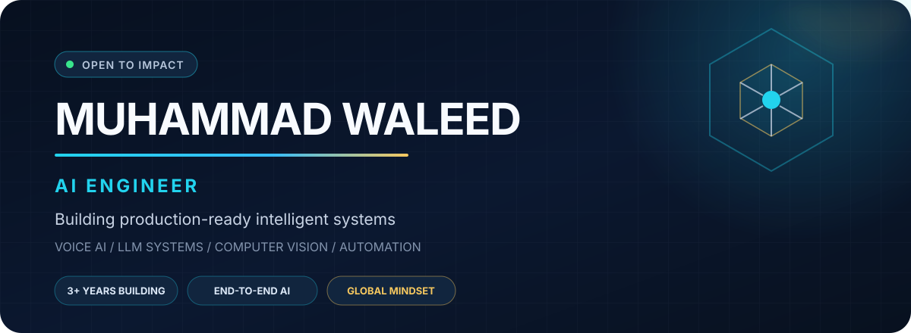
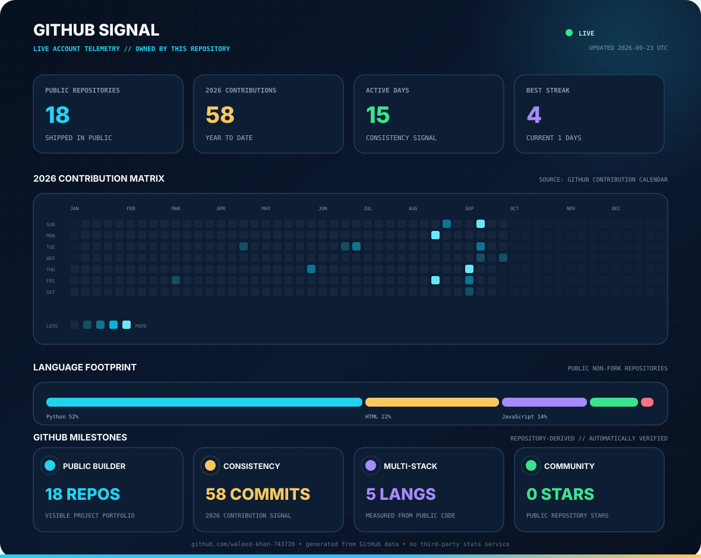
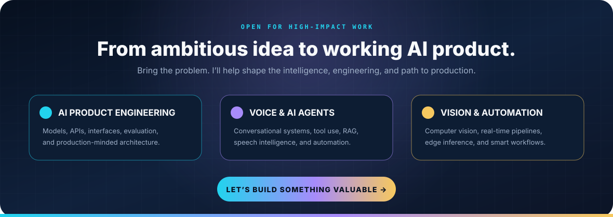

<div align="center">



<br/>

<a href="https://www.linkedin.com/in/muhammad-waleed-%E2%9A%A1%EF%B8%8Fai-engineer-73b414237/"></a>
<a href="https://www.fiverr.com/waleed743726?up_rollout=true"></a>
<a href="https://www.kaggle.com/muhammadwaleed743726"></a>


### I turn AI ideas into reliable products.

**3+ years building applied AI and data projects** across voice intelligence, computer vision, LLM workflows, machine learning, automation, and AI-backed web systems.

`Islamabad, Pakistan` · `Open to global opportunities` · `Available for high-impact AI work`

</div>

---

## Executive profile

I am an **AI Engineer** focused on the full journey from an ambiguous business problem to a working intelligent system. My work combines model development with the engineering required to make AI useful: real-time pipelines, APIs, automation, interfaces, integrations, and deployment-minded architecture.

I am most valuable where **AI meets software engineering**—turning LLMs, speech, vision, and predictive models into practical products that teams and customers can actually use.

<table>
<tr>
<td width="33%" valign="top">

### Build

AI applications, agents, RAG workflows, ML models, computer-vision pipelines, and real-time experiences.

</td>
<td width="33%" valign="top">

### Engineer

FastAPI services, REST integrations, automation, async processing, inference pipelines, and product interfaces.

</td>
<td width="33%" valign="top">

### Optimize

Latency, reliability, model serving, edge inference, workflow quality, and the path from prototype to production.

</td>
</tr>
</table>

---

## Selected work

<table>
<tr>
<td width="50%" valign="top">

### Voice AI & intelligent agents

Conversational and voice-first AI concepts built around LLM orchestration, tool use, speech interaction, and practical automation.

**Focus:** real-time interaction · agent workflows · API integration · human-centered UX

<a href="https://github.com/waleed-khan-743726/AI-Agent-Voice-Sample"><b>Explore voice sample →</b></a>

</td>
<td width="50%" valign="top">

### Veyronix Technology platform

An official multi-page technology company website with operational backend integrations for business workflows and customer engagement.

**Stack:** JavaScript · Firebase · Google APIs · Resend · Vercel

<a href="https://github.com/waleed-khan-743726/veyronix-technology-website"><b>View repository →</b></a>

</td>
</tr>
<tr>
<td width="50%" valign="top">

### Smart aerial navigation system

An AI-assisted drone concept combining live video, object and face detection, target tracking, voice control, and responsive flight operations.

**Stack:** Python · OpenCV · YOLO · ONNX Runtime · DJI Tello · UDP

<b>Engineering focus:</b> real-time inference, low-latency control, and asynchronous vision processing

</td>
<td width="50%" valign="top">

### Voice emotion recognition

An end-to-end speech emotion prototype covering model training and a lightweight web experience for inference.

**Stack:** Python · audio ML · Flask · HTML/CSS

<a href="https://github.com/waleed-khan-743726/voice-emotion-recognition"><b>View repository →</b></a>

</td>
</tr>
<tr>
<td width="50%" valign="top">

### IBM AI Engineering portfolio

Hands-on work spanning machine learning, neural networks, deep learning, PyTorch, TensorFlow, Keras, LLM architecture, and an AI capstone.

<a href="https://github.com/waleed-khan-743726/IBM-AI-Engineer-Certification-Course"><b>Explore the coursework →</b></a>

</td>
<td width="50%" valign="top">

### Applied ML portfolio

A multi-year body of work covering exploratory analysis, preprocessing, recommendation systems, supervised learning, and practical modeling.

<a href="https://github.com/waleed-khan-743726?tab=repositories"><b>Browse all repositories →</b></a>

</td>
</tr>
</table>

---

## Technical leadership map

| Domain | Capabilities |
|---|---|
| **Generative AI** | LLM applications, RAG, AI agents, tool calling, prompt design, workflow orchestration |
| **Voice AI** | Speech-driven experiences, conversational workflows, audio intelligence, real-time interaction |
| **Computer Vision** | Object detection, tracking, face recognition, image processing, live video pipelines |
| **Machine Learning** | Classification, regression, clustering, recommendation systems, evaluation, feature engineering |
| **Deep Learning** | PyTorch, TensorFlow, Keras, CNNs, neural-network training and inference |
| **AI Engineering** | FastAPI, REST APIs, Streamlit, automation, integrations, async workflows, deployment-minded design |
| **Edge & real-time AI** | ONNX Runtime, TensorRT, latency-aware inference, event-driven processing, hardware-connected systems |

<div align="center">

### Core stack


</div>

---

## How I work

```text
Business goal
    ↓
Problem framing → data & model strategy → rapid prototype
    ↓
API + product integration → evaluation → reliability & latency work
    ↓
Useful, measurable AI system
```

- **Outcome-first:** start with the user and business result, then choose the model.
- **Systems thinking:** treat data, inference, APIs, UX, and operations as one product.
- **Production mindset:** design for reliability, observability, latency, and maintainability early.
- **Clear communication:** make complex AI decisions understandable to technical and business stakeholders.

---

## GitHub signal

<div align="center">



<sub>Real GitHub contribution data · animated daily and monthly line graphs · refreshed automatically every hour</sub>

</div>

---

## Let’s build something valuable

<div align="center">

<a href="https://www.linkedin.com/in/muhammad-waleed-%E2%9A%A1%EF%B8%8Fai-engineer-73b414237/"></a>

### Choose the next move

<a href="https://www.linkedin.com/in/muhammad-waleed-%E2%9A%A1%EF%B8%8Fai-engineer-73b414237/"></a>
<a href="https://www.fiverr.com/waleed743726?up_rollout=true"></a>
<a href="https://github.com/waleed-khan-743726?tab=repositories"></a>

<br/><br/>

<sub><b>Available for AI engineering roles · product collaborations · selective freelance engagements</b></sub>

</div>
